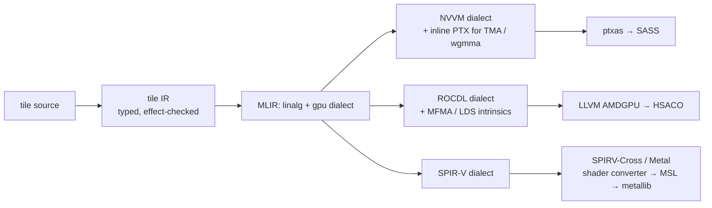

# GPU-native language for LLM inference — design document

2026-09-22 · Alfonso Sastre

## Goal and scope

One source program for an LLM forward pass (attention, MLP, norms, sampling) that compiles to roofline-class kernels on NVIDIA (Hopper/Blackwell), AMD (CDNA3/RDNA4) and Apple Metal (M-series), with no per-target kernel rewrites.

Success criterion for v1: Llama-3-8B class model in 4-bit weights, decode within 85% of the best hand-written kernel on each target (llama.cpp Metal, vLLM/FlashAttention-3 on Hopper, ROCm aiter on MI300), from a single ~2k-line model definition.

In scope: the kernel language, the graph compiler, the inference runtime primitives (KV cache, batching, quantised formats), three backends. Out of scope for v1: training, distributed multi-GPU, dynamic shapes beyond ragged batch, a Python-free frontend (v1 is callable from Python and Rust).

Working name: **tile** (a program is a graph of typed tile operations).

## Problem statement

C-family GPU languages (CUDA C++, HIP, Metal Shading Language) reach peak performance, but only through hand work that the compiler cannot check, port or reuse. The cost is not the ceiling; it is that reaching the ceiling takes months per kernel per target.

| Limitation | Consequence for inference |
| --- | --- |
| Memory spaces are all `T*` | Compiler cannot place, pipeline or double-buffer data; cp.async / TMA / threadgroup copies written by hand |
| Pointers may alias | Loads cannot be reordered; software pipelining and fusion cannot be proven legal |
| Barriers are untyped side effects | Races and deadlocks found at runtime; syncs over-inserted to be safe |
| Layout lives in index arithmetic | Swizzles and bank-conflict avoidance are not portable; each target re-derives them |
| Kernel is the compilation unit | No cross-kernel fusion; decode (bandwidth-bound) pays a HBM round trip per launch |
| Numeric formats are bit hacks | fp8 / int4 / MXFP4 dequant is hand-written; scale semantics unchecked |
| Three vendor dialects | Same algorithm written three times; feature gaps (TMA, wgmma, simdgroup matrix) leak into source |

Decode for an 8B model at batch 1 moves ~4 GB of weights per token and does ~16 GFLOP: the language cannot change that ratio, so its job is to guarantee zero extra bytes (fusion, correct residency) and full bandwidth (correct layout, no bank conflicts) on every target.

## Feasibility verdict

Yes, doable for one person plus tooling, on the condition that the language lowers to an existing IR per target rather than emitting machine code itself. Every piece of the pipeline has been shipped by someone; nobody has combined them.

Evidence that the three-target goal is reachable:

- llama.cpp runs one model definition on Metal, ROCm and CUDA today, with hand-written kernels per backend. The proof that the *algorithm* is portable exists; what is missing is portable *codegen*.
- Triton lowers one source to NVIDIA and AMD at 80–95% of hand-written performance for GEMM and attention; Metal has no upstream Triton backend, which is the largest single gap.
- Apple ships MLX: tiles, lazy graphs, fusion, Metal codegen, in ~2 years by a small team.
- Mojo and MLIR show that a new frontend on MLIR gets NVPTX and AMDGPU for free; MLIR has a SPIR-V dialect, and Metal accepts SPIR-V via translation tools (SPIRV-Cross to MSL, or directly through Apple's Metal shader converter).

What makes it hard, ordered by risk:

1. **Metal**: no warp-level async copy (no TMA/cp.async equivalent), no cluster level, simdgroup matrix ops instead of wgmma, unified memory changes the cost model. The hierarchy algebra must permit a target to say "this level does not exist".
2. **Tensor-core instruction shapes differ**: wgmma 64×N×16 on Hopper, MFMA 16×16×32 on CDNA3, simdgroup 8×8 on Apple. The tile type must abstract the MMA atom and let the scheduler pick it.
3. **Performance parity on all three at once**: budget one backend at a time; the danger is 60% everywhere.
4. **Autotuning cost**: three targets × many shapes; needs a persistent tuning cache and a cost model good enough to skip most of the search.

Realistic horizon: a correct (not fast) 8B forward on all three targets in 6 months; roofline-class on NVIDIA in 9; on AMD and Metal in 12–15. A single-person effort should pick NVIDIA or Metal first depending on what hardware is on the desk, and treat the third target as a validation of the abstraction, not a launch feature.

## Core language design

The unit of value is a tile: a fixed-shape array whose element type, layout and memory space are all part of its type. Everything the compiler needs to place, move and pipeline data is therefore statically known.

### Tile type

```
Tile[T, Shape, Layout, Space]
  T      : f32 | f16 | bf16 | fp8e4m3 | fp8e5m2 | int8 | int4 | mxfp4 | nvfp4
  Shape  : static dims, e.g. (64, 128); ragged dims allowed only at the graph level
  Layout : row | col | Swizzle(bits) | MmaFrag(atom) | Blocked(inner)
  Space  : Global | Shared | Reg | Frag | Unified (Metal)
```

An `int4` tile carries its scale tensor in the type (`Quant[int4, group=32, scale=f16]`), so dequantisation is generated code with checked rounding semantics, not a helper someone forgot to update.

### Memory spaces are linear resources

A `Shared` or `Reg` tile is an affine value: it is consumed exactly once unless explicitly `dup`'d. Consequences:

- No aliasing, so every load/store reordering the scheduler wants is provably legal.
- Double-buffering is a compiler transform (allocate two, rotate), not user code.
- Shared-memory budget per block is a type-level sum, checked at compile time against the target.

### Effect-typed movement and synchronisation

Moving a tile between spaces is a typed operation that returns a future carrying an effect:

```
let a: Future[Tile[f16,(64,64),Swizzle(3),Shared]] = copy(g_tile) with barrier b0
mma(a.wait(), w)   // wait() discharges the effect; using `a` without it is a type error
```

Barriers are values with an arrival count in the type. A program that could read before arrival does not compile. The compiler inserts the minimal set of fences per target (mbarrier on Hopper, `s_waitcnt` on AMD, threadgroup barriers on Metal) from the effect graph, not from user annotations.

### Layouts are algebra, not indexing

Following CuTe, a layout is a function `index → offset` composed from strides and swizzles. `Layout` is a type with a small algebra (compose, partition, tile), so the compiler can:

- verify a copy is bank-conflict-free for the target's bank width;
- derive the register fragment layout an MMA atom expects;
- reject a layout the target cannot load in one instruction rather than emitting a slow path silently.

### Numeric semantics

Every arithmetic op declares accumulation type and rounding. `mma(a: f16, b: fp8) -> f32` is explicit; an implicit narrowing is a compile error. This is what makes mixed-precision inference reproducible across three vendors whose default rounding differs.

## Schedule, hardware algebra and autotuning

An algorithm is written once against an abstract execution hierarchy; a schedule binds it to a concrete target. The schedule is type-checked against the algorithm, so a bad schedule is a compile error, not a wrong answer or a silent 3× slowdown.

### Hardware hierarchy as an algebra

```
Level = Lane < Warp < Block < Cluster < Device
```

Each target instantiates the levels it has, with sizes and capabilities:

| Level | NVIDIA Hopper | AMD CDNA3 | Apple M-series |
| --- | --- | --- | --- |
| Lane | 1 thread | 1 thread | 1 thread |
| Warp | 32, wgmma 64×N×16 | 64 (wave64), MFMA 16×16×32 | 32 (simdgroup), simdgroup_matrix 8×8 |
| Block | ≤1024 threads, 228 KB shared, TMA + mbarrier | ≤1024, 64 KB LDS, no async copy engine | ≤1024, 32 KB threadgroup, no async copy |
| Cluster | up to 16 blocks, DSMEM | absent | absent |
| Memory | HBM3 ~3.3 TB/s, separate | HBM3 ~5.3 TB/s, separate | unified, ~400–800 GB/s |

A schedule that asks for `Cluster` on a target without it is rejected; a schedule that asks for async copy on Metal lowers to a software-pipelined synchronous copy with a cost-model warning.

### Algorithm / schedule split

```
algo attention(q: Tile, k: Tile, v: Tile) -> Tile { ... }   // pure, tile ops only

schedule attention for hopper {
  tile   (q: 64, kv: 128)
  mma    wgmma(64x128x16, fp8 -> f32)
  copy   k, v via TMA, stages 3
  layout k: Swizzle(128B)
  warps  producer 1, consumer 2
}

schedule attention for metal {
  tile   (q: 32, kv: 64)
  mma    simdgroup(8x8, f16 -> f32)
  copy   k, v via threadgroup, stages 2
}
```

The Halide lesson applied: the algorithm has no target-specific text, so correctness is proven once; the schedule is where all the vendor knowledge lives, and it is short.

### Autotuning

Schedules can leave parameters open (`tile (q: ?, kv: ?)`, `stages: ?`). The compiler searches over them using a roofline cost model (bytes moved per level × bandwidth, MMA atoms × throughput, register pressure vs occupancy) and only benchmarks the top-k candidates. Results are keyed by (target ID, op signature, shape bucket) in a persistent cache shipped with the model, so end users never tune.

## Graph compilation and inference runtime

The compilation unit is the whole forward pass, not a kernel. Launch boundaries are an output of the compiler, chosen by a bytes-moved cost model, so the programmer never decides what to fuse.

### Graph level

A model is a DAG of tile ops over tensors with one ragged batch dimension. The graph compiler:

1. Infers shapes and quantised formats through the DAG.
2. Partitions into kernels by minimising HBM traffic: an op joins the kernel upstream of it if its inputs fit in shared/register budget of the target (from the hierarchy table) and it adds no barrier that stalls the pipeline.
3. Emits one persistent "megakernel" per decode step when the target allows (Hopper, CDNA3), or a short kernel sequence when it does not (Metal, where command-buffer overhead is low anyway).
4. Materialises schedules per kernel from the tuning cache or the autotuner.

Typical decode fusion for one transformer layer: RMSNorm → QKV GEMM (int4 dequant fused) → RoPE → attention over paged KV → output GEMM → residual add → RMSNorm → gate/up GEMM → SiLU·mul → down GEMM → residual add, in two or three launches instead of twelve.

### Runtime primitives with types

| Primitive | Type-level guarantee |
| --- | --- |
| `PagedKV[T, page=16, layout]` | Attention kernels take a page table, not a pointer; page layout matches the MMA fragment layout so K/V load straight into fragments |
| `Batch[ragged]` | Sequence lengths are data; every kernel is generated for the ragged case, no padding path |
| `Quant[fmt, group, scale]` | Dequant fused into the consuming GEMM; scale dtype and rounding checked |
| `Speculate[draft, verify]` | Draft-then-verify is a control-flow construct; rollback of the KV cache is generated, not hand-coded |
| `Sampler` | Top-k/top-p/temperature as a tile op on logits, fused into the LM-head GEMM's epilogue |

### Memory model at the runtime level

Unified memory (Metal) and discrete memory (NVIDIA, AMD) are the same type `Global` with a different cost table; the runtime API is identical. The only user-visible difference is that `Unified` targets can skip weight staging.

### Frontend

v1 frontends: a Rust DSL (embedded, macro-based) and a Python binding that imports a safetensors checkpoint plus a model definition. PyTorch graph import (via torch.export) is a v2 item; it is not needed to run Llama-class models and would pull in a large surface early.

## Backend strategy

All three targets lower through MLIR to an existing vendor toolchain. The language never emits machine code; it emits the IR the vendor compiler already optimises well, plus the intrinsics that IR cannot express on its own.



The front half (tile IR → MLIR) is shared and carries all the type information; each backend is a lowering pass plus a target description (the hierarchy table) plus a small intrinsics library.

| Target | Lowering path | What is free | What must be built | Perf risk |
| --- | --- | --- | --- | --- |
| NVIDIA Hopper / Blackwell | MLIR gpu → NVVM → PTX | Triton and CUTLASS prove every pattern; NVVM dialect exposes wgmma, TMA, mbarrier | Warp-specialised producer/consumer lowering; Blackwell tcgen05 / TMEM as a new `Space` | Low |
| AMD CDNA3 (MI300) / RDNA4 | MLIR gpu → ROCDL → HSACO | Triton AMD backend and aiter show MFMA reaching ~80–90% of peak | Wave64 vs wave32 in the hierarchy; no async copy engine, so software pipelining through LDS; MFMA fragment layouts | Medium |
| Apple Metal (M3/M4/M5) | MLIR → SPIR-V → MSL, or direct MSL text emission | MLX shows simdgroup_matrix at near-peak on unified memory; Metal compile is fast, launch overhead low | The whole backend: no upstream Triton or MLIR Metal target exists; simdgroup 8×8 atoms; 32 KB threadgroup limit forces smaller tiles; no cluster, no async copy | High (engineering), low (physics: bandwidth-bound decode on unified memory is forgiving) |

### Metal decision

Two options: emit SPIR-V and translate, or emit MSL source text directly. Recommendation: emit MSL text directly for v1. It is a small C-like surface, it keeps `simdgroup_matrix` and threadgroup intrinsics first-class without translation loss, and it is debuggable in Xcode's GPU capture. Revisit SPIR-V if a Vulkan backend (Intel, Qualcomm) is ever wanted, since that path would then serve two targets.

### Shared-memory and MMA atom abstraction

The tile type's `Frag[atom]` layout takes the atom from the target: `wgmma_m64n128k16`, `mfma_f32_16x16x32_f8`, `simdgroup_8x8_f16`. A GEMM written once tiles over the atom it is given; the schedule chooses block tiles that are integer multiples of it. This is the single abstraction that makes three targets one codebase.

## Compiler architecture and toolchain

Rust frontend, MLIR middle, vendor back ends; one crate per stage so the pieces can ship independently and be tested against each other.

| Stage | Crate | Responsibility | Depends on |
| --- | --- | --- | --- |
| Parse + typecheck | `lex-front` | Tile/Layout/Space types, linearity, effect checking, schedule validation against the target table | none |
| Tile IR | `lex-ir` | SSA IR over tiles; canonical form for fusion and scheduling | lex-front |
| Graph compiler | `lex-graph` | Shape inference, quant propagation, kernel partitioning by cost model, persistent-kernel emission | lex-ir |
| Scheduler + autotuner | `lex-sched` | Fill open schedule params; roofline cost model; benchmark top-k; tuning cache | lex-ir, backends |
| MLIR bridge | `lex-mlir` | Lower tile IR to linalg/gpu dialects via melior (Rust MLIR bindings) | lex-ir |
| Backends | `lex-nv`, `lex-amd`, `lex-metal` | Target table, intrinsics, final lowering, driver loading | lex-mlir |
| Runtime | `lex-rt` | Paged KV, ragged batch, weight loading (safetensors), sampling loop, per-target driver glue | backends |
| Python | `lex-py` | pyo3 binding: load model, generate | lex-rt |

Testing is layered the same way. Each tile op has a reference interpreter in the frontend; every backend must match it bit-for-bit for integer paths and within declared ULP for float paths. A 12-layer toy transformer is the CI model; Llama-3-8B is the nightly.

Debuggability is a design constraint: every emitted kernel keeps a source map back to the algorithm and schedule lines, and the compiler can dump the fusion decision ("op X not fused: shared budget 228 KB exceeded by 12 KB") as text.

## Milestones

Each milestone ends with a model running, not a feature list; the first target is the one whose hardware is on the desk (assumed here: Apple M-series for daily work, NVIDIA via cloud for parity runs).

| # | Milestone | Deliverable | Exit test | Est. |
| --- | --- | --- | --- | --- |
| M0 | Type system on paper | Tile/Layout/Space/effect rules, target table format, 5 worked kernels typed by hand | Peer review; no code | 3 wk |
| M1 | Frontend + interpreter | `lex-front`, `lex-ir`, reference interpreter | 12-layer toy transformer runs on CPU interpreter, matches PyTorch | 6 wk |
| M2 | First backend, correct | Metal backend, MSL emission, no scheduling | Llama-3-8B int4 decodes correct tokens on an M-series Mac at any speed | 8 wk |
| M3 | Scheduling + fusion | `lex-sched`, `lex-graph`, one fused decode layer | 8B decode ≥ 70% of llama.cpp Metal tok/s | 8 wk |
| M4 | Second backend | NVIDIA via MLIR NVVM, TMA + wgmma intrinsics | 8B decode correct on H100; ≥ 60% of vLLM | 8 wk |
| M5 | NVIDIA to roofline | Warp specialisation, persistent kernel, autotune cache | ≥ 85% of vLLM / FA3 at batch 1 and 32 | 8 wk |
| M6 | Third backend | AMD via ROCDL, MFMA atoms, LDS pipelining | 8B decode correct on MI300; ≥ 70% of aiter | 8 wk |
| M7 | Parity + release | All three ≥ 85%; Python package; docs | Public 0.1 | 6 wk |

Total ≈ 55 weeks solo; 9 months with one collaborator on the backend that is not on the desk. M2 before M3 is deliberate: a correct, slow model on real hardware exposes type-system mistakes far earlier than a fast toy.

- [ ] Decide first backend (Metal vs NVIDIA) from available hardware
- [ ] Confirm melior (Rust MLIR) covers the NVVM/ROCDL ops needed, else plan a C++ shim
- [ ] Pick the 5 hand-typed kernels for M0: GEMM, flash-attention decode, RMSNorm, RoPE, int4 dequant

## Risks, open questions and prior art

The main risk is not technical failure but landing at 60% of hand-written speed on all three targets, which is worse than any one of them done well. Mitigation is the milestone order: one target to roofline before the second one starts.

| Risk | Likelihood | Mitigation |
| --- | --- | --- |
| Metal backend cannot express software pipelining well enough; decode stalls | Medium | MLX reaches near-bandwidth on unified memory with plain threadgroup copies; copy their tile sizes as the initial schedule |
| Linearity makes common kernels awkward to write (e.g. reusing K tile across query blocks) | Medium | Explicit `dup` plus borrow-style read-only views; validate in M0 on the 5 hand-typed kernels |
| MLIR NVVM lags new NVIDIA features (Blackwell tcgen05) | High | Inline PTX escape hatch, typed at the boundary; accept 6-month lag on newest silicon |
| Autotuning search too slow for three targets | Medium | Roofline cost model prunes; tuning cache shipped with model weights |
| melior / Rust-MLIR maturity | Medium | Fallback: C++ shim over MLIR C API, Rust everywhere else |
| Blackwell/MI355 shift the cost model (TMEM, larger LDS) | Low | Target table is data; hierarchy algebra permits new spaces |

### Open questions

- Should ragged batch be in the type or only at the graph boundary? Type-level ragged dims complicate layout algebra; graph-only means every kernel takes a length tensor.
- Persistent megakernel vs kernel sequence on Metal: command-buffer overhead is low enough that fusion may not pay; measure at M3.
- Whether to expose the schedule language to end users at all, or ship only compiler-chosen schedules plus a tuning cache.
- License and governance if this is an Alpibru project: the MLIR dependency is Apache-2 with LLVM exception; a permissive license for the frontend keeps vendor contributions possible.

### Prior art and what is taken from each

| Project | Taken | Not enough because |
| --- | --- | --- |
| Triton | Block-level programming, MLIR lowering, NVIDIA + AMD parity numbers | Untyped memory movement; no Metal; kernel is the unit |
| CuTe / CUTLASS 4 | Layout algebra, MMA atoms, TMA + mbarrier patterns | C++ templates; NVIDIA only |
| ThunderKittens | Tiles as the primitive, small surface | NVIDIA only; no type-level effects |
| Halide / TVM | Algorithm/schedule split, autotuning | Not tile/MMA-native; TVM's scheduling surface is large |
| Mojo | Ownership + MLIR frontend in one language | Closed compiler at the time of writing; general-purpose scope |
| MLX | Metal codegen, lazy graph, unified-memory cost model | Apple-first; kernels still hand-written in MSL |
| Futhark / Dex | Pure dataflow, size types | No tensor-core or memory-hierarchy model |
| Pallas (JAX) | Block specs across TPU/GPU | Python-embedded; performance below Triton on GPU |

The combination this document proposes, typed memory movement + effect-typed synchronisation + graph-level fusion + inference runtime types, appears in none of them.
